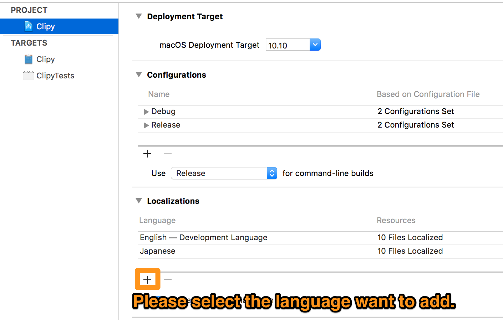

# Contributing to Clipy

:tada: Thank you for contributing to Clipy :tada:

## Localization

### Add New Language

After adding the language, please make changes to the various `.strings` files as follows.

### Modify an Existing Language
The files to be localized are as follows.
- Localizable ( `Clipy/Resources/Localizable.xcstrings` )
- Settings ( `Clipy/Resouces/Settings.xcstrings` )